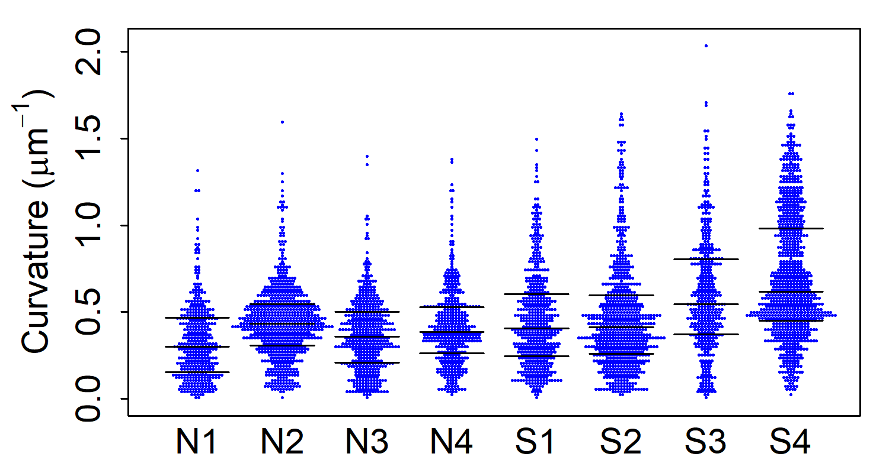
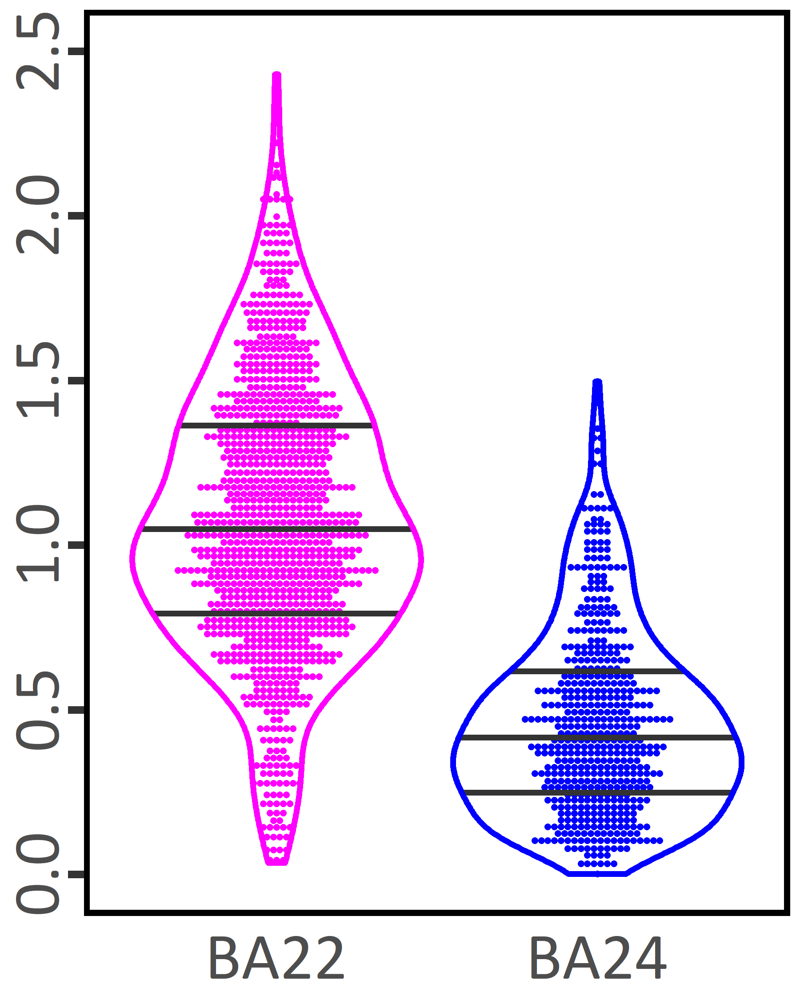
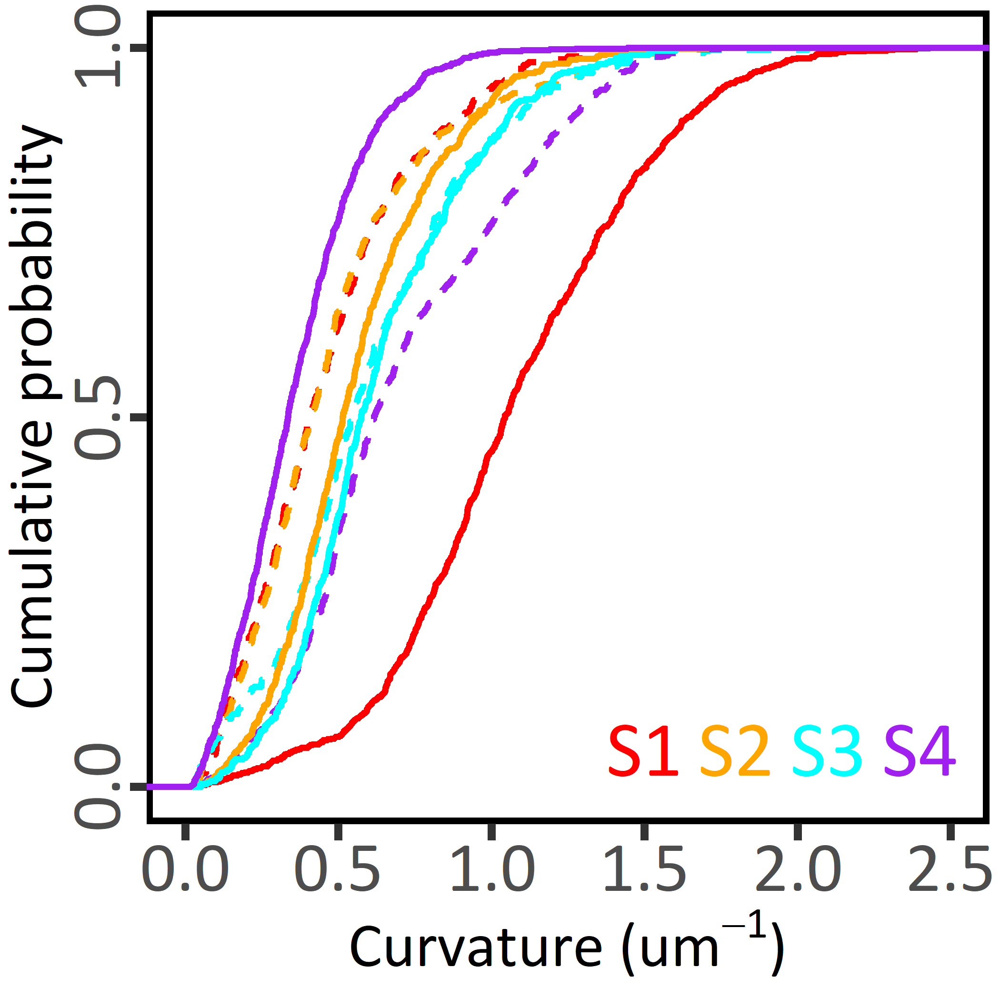

# R scripts to generate publication-ready figures.  
 
  beeswarm200507.R 
  <i>Transl Psychiatry</i> <b>9</b>, 85 (2019). <a href="https://dx.doi.org/10.1038/s41398-019-0427-4">DOI</a> 
 
 
  
 
  beevioCs9procCurv200315.R 
  <i>Transl Psychiatry</i> <b>11</b>, 49 (2021). <a href="https://doi.org/10.1038/s41398-020-01173-x">DOI</a> 
 
 

 
  cumDistribBA22vs24scrLett200413.R 
  <i>Transl Psychiatry</i> <b>11</b>, 49 (2021). <a href="https://doi.org/10.1038/s41398-020-01173-x">DOI</a> 
 
